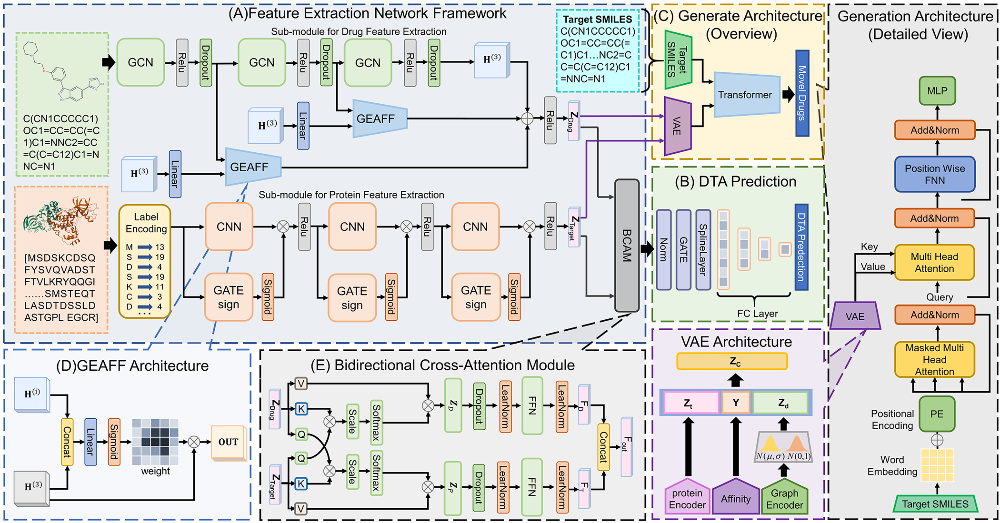

# AFE-DTA: Adaptive Feature Enhancement for Drug-Target Affinity Prediction
AFE-DTA integrates the Graph Encoding Adaptive Feature Fusion module (GEAFF), Bidirectional Cross Attention module (BCAM), and Learnable Spline Transform Network (LST-Net). It effectively addresses the over-smoothing problem of GCN and better captures complex interaction features.

Flowchart of AFE-DTA (A) Feature extraction network, which is divided into two parts: sub-module for drug feature extraction and sub-module for protein feature extraction, and combines two dedicated networks: GEAFF and BCAM; (B) LST-Net; (C) Drug generation network; (D) GEAFF; (E) BCAM.
